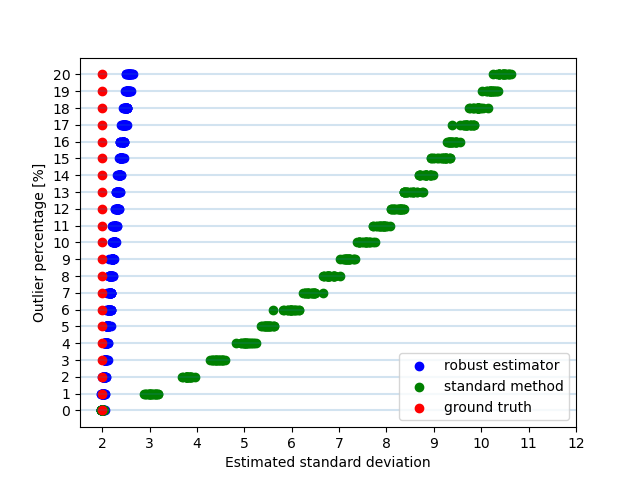

外れ値に頑強な標準偏差推定法
============================

標準偏差の推定は非常に広範な問題に出現する。ここでは一般的な計算方法よりも外れ値に対してロバストな標準偏差の推定方法を紹介する。

通常の計算方法
~~~~~~~~~~~~~~

ある正規分布から生成される実数列を考える。

.. math::
    x_{i} \sim \mathcal{N}(\mu,\, \sigma^2),\,i=1,...,n

このとき、標準偏差はふつう次のように計算される。

.. math::
    \hat{\sigma}_{std} = \sqrt{\frac{1}{n-1}\sum_{i=1}^{n}(x_{i} - \bar{x})^{2}}
    :label: sigma_std

外れ値が含まれる場合
~~~~~~~~~~~~~~~~~~~~

なんらかの要因により、 :math:`x_{i}` のいくらかが正規分布に従わない場合、通常の標準偏差の計算方法 :math:numref:`sigma_std` では問題が生じる。
:math:numref:`sigma_std` の計算方法ではすべてのサンプルについて平均値との二乗誤差を計算し、合算している。このため、 :math:`x_{i}` に少数でも外れ値が含まれていると標準偏差 :math:`\hat{\sigma}_{std}` の計算結果に影響を与えてしまう。

外れ値に頑強な標準偏差推定法
~~~~~~~~~~~~~~~~~~~~~~~~~~~~

この問題に対処できる標準偏差の計算方法が、MAD(Median Absolute Deviation)を用いた次の式である。

.. math::
    \sigma_{robust}=\frac{\operatorname{MAD}}{\Phi^{-1}(\frac{3}{4})}\\
    :label: sigma_robust

ここで、 :math:`\Phi` は正規分布の累積分布関数(CDF, Cumulative Distribution Function)である。逆関数の :math:`\Phi^{-1}` はPPF(Percent Point Function)などと呼ばれる。MADは次のように計算される指標である。

.. math::
    \operatorname{MAD}=\operatorname{median}_{i}(\left|x_{i}−\operatorname{median}_{j}(x_{j})\right|)

この標準偏差推定法 :math:numref:`sigma_robust` は、通常の計算方法 :math:numref:`sigma_std` に比べて外れ値に対して頑強であることが知られている。

実験
~~~~

通常の標準偏差の計算方法 :math:numref:`sigma_std` と外れ値に対して頑強な計算方法 :math:numref:`sigma_robust` を、実験により比較した。

データセット全体のサイズを :math:`N` とする。このうち :math:`m` 個のサンプルを平均 :math:`0` 、標準偏差 :math:`\sigma` の正規分布に基づいて生成し、残りの :math:`N-m` サンプルを外れ値として :math:`-20\sigma` から :math:`20\sigma` までの範囲の一様分布に従って生成した。

.. math::
   \begin{align}
    x_{i} &\sim \mathcal{N}(0,\, \sigma^2),\, && i = 1,...,m \\
    x_{j} &\sim \mathcal{U}(-20\sigma,\, 20\sigma),\, && j = N-m+1,...,N
   \end{align}
   :label: experiment_dataset

このデータセットに対して通常の方法 :math:numref:`sigma_std` とロバストな方法 :math:numref:`sigma_robust` それぞれの方法で標準偏差を計算した。
データセットのうち外れ値の割合 :math:`(N-m)/N` を0%から20%まで徐々に増やしていき、それぞれの方法で計算した標準偏差の値がどのように変化していくかを観察した。

外れ値の割合が0%、10%、20%のときのデータのヒストグラムを示す。

+----------------------------------------------------+
| .. figure:: robust_stddev_estimator/outlier00.png  |
|    :scale: 60 %                                    |
|                                                    |
|    外れ値の割合0%                                  |
+----------------------------------------------------+
| .. figure:: robust_stddev_estimator/outlier10.png  |
|    :scale: 60 %                                    |
|                                                    |
|    外れ値の割合10%                                 |
+----------------------------------------------------+
| .. figure:: robust_stddev_estimator/outlier20.png  |
|    :scale: 60 %                                    |
|                                                    |
|    外れ値の割合20%                                 |
+----------------------------------------------------+

外れ値の割合を0%から20%まで変化させたときの標準偏差の値の変化を示す。

赤い点が母分布のうちの正規分布の標準偏差( :math:numref:`experiment_dataset` の :math:`\sigma` )、緑の点が標準的な方法 :math:numref:`sigma_std` で計算した標準偏差、青い点がロバストな手法で計算した標準偏差 :math:numref:`sigma_robust` の値である。

データセットはそれぞれの外れ値の割合について20回生成しているため、標準偏差も各割合について20回計算して表示している。

標準的な方法で計算した場合、外れ値が1%でも含まれていると、標準偏差の値は約1.5倍も大きく推定されてしまう。一方でロバストな手法で計算すると、外れ値が10%程度含まれていても標準偏差の値はそれほど大きく推定されず、外れ値に対して極めて頑強であることがわかる。
